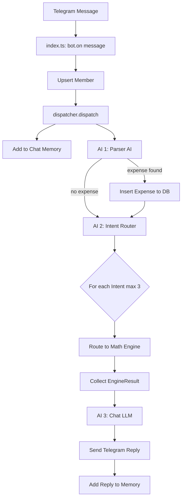

# SplitSeconds Bot V3 — Implementation Walkthrough

## ✅ All 12 Files Implemented

| # | File | Purpose |
|---|------|---------|
| 1 | `types.ts` | All shared types |
| 2 | `chatMemory.ts` | Sliding window memory (10+1) |
| 3 | `engines/balanceEngine.ts` | M1: net balance per member |
| 4 | `engines/settlementEngine.ts` | M2: greedy minimal settlements |
| 5 | `engines/userViewEngine.ts` | M3: per-user balance view |
| 6 | `engines/categoryEngine.ts` | M4: totals by tag |
| 7 | `engines/historyEngine.ts` | M5: time/user/category filters |
| 8 | `parserAI.ts` | AI 1: expense extraction |
| 9 | `intentRouter.ts` | AI 2: intent classification |
| 10 | `chatLLM.ts` | AI 3: natural reply generator |
| 11 | `dispatcher.ts` | Orchestrator |
| 12 | `index.ts` | Telegram bot entry point |

---

## 1. Execution Flow Diagram



---

## 2. Example Conversation

```
User (Raj): "paid 500 for lunch"
→ Parser AI extracts: {payer: 123, amount: 500, description: "lunch", participants: null, tags: []}
→ Intent: RECORD_EXPENSE (from parser)
→ Saved to DB
→ Chat LLM: "Rs.500 for lunch logged under Raj 👍"

User (Priya): "raj ka balance kya hai"
→ Parser: null (no expense)
→ Intent Router: USER_BALANCE {actor: "raj"}
→ M1 → M3 computes Raj's view
→ Chat LLM: "Raj has paid Rs.500 total. Everyone owes him Rs.125 each right now."
```

---

## 3. Multi-Intent Handling

```
User: "total bata, raj ne kitna diya, kal petrol kisne bhara"

→ Parser AI: null
→ Intent Router returns 3 intents:
  [GROUP_BALANCES, USER_CONTRIBUTION(actor=raj), TIME_FILTERED_PAYER(yesterday, petrol)]
→ Engine 1: GROUP_BALANCES → computes all balances
→ Engine 2: USER_CONTRIBUTION → queries raj's total paid
→ Engine 3: TIME_FILTERED_PAYER → filters yesterday + petrol tag
→ All 3 EngineResults passed to Chat LLM
→ Single combined reply
```

---

## 4. Reply Context Handling

```
[Original message by Aman]: "paid 300 for chai"
[Raj replies to that message]: "ye galat hai, 200 tha"

→ replyText = "paid 300 for chai" (from reply_to_message)
→ Passed to Parser AI + Chat LLM as context
→ Intent Router: CORRECT_LAST or CORRECT_BY_DESCRIPTION
→ Works even if original message is older than 10-message window
```

---

## 5. Settlement Flow

```
User: "settle kar do"

→ Parser: null
→ Intent: TRIGGER_SETTLEMENT
→ processIntent:
  1. computeGroupBalances (M1) → {Raj: +300, Priya: -150, Aman: -150}
  2. computeMinimalSettlements (M2) → [{Priya→Raj: 150}, {Aman→Raj: 150}]
  3. INSERT into settlements: {group_id, total_amount, balances_snapshot, transactions_snapshot}
  4. UPDATE expenses: SET settlement_id for all unsettled
  5. Chat LLM formats reply
→ "Settlement done! Total: Rs.900
   Priya → Raj: Rs.150
   Aman → Raj: Rs.150"
```

---

## 6. Balance Computation Example

```
Expenses (unsettled):
  Raj paid 600, participants: [Raj, Priya, Aman] (all)
  Priya paid 300, participants: [Priya, Aman]

Balance formula: total_paid - total_share

Raj:  +600 - 200 = +400 (gets back)
Priya: +300 - 200 - 150 = -50 (owes)
Aman:  0 - 200 - 150 = -350 (owes)

Settlement: Aman → Raj: Rs.350, Priya → Raj: Rs.50
```

---

## 7. Failure Scenario

```
User: "asjkdahskd random text"

→ Parser AI: null (no expense)
→ Intent Router: [{type: UNKNOWN, confidence: 0.1}]
→ Confidence < 0.3 and no parsed expense → skip
→ dispatch returns null
→ No reply sent (bot stays silent on irrelevant messages)
```

---

## 8. Hallucination Prevention

| Layer | Prevention |
|-------|-----------|
| Parser AI | temp=0.1, strict JSON schema, validates amount>0 and payer is number |
| Intent Router | temp=0.1, classifies only — never computes numbers |
| Math Engines | Pure TypeScript, zero AI, deterministic arithmetic |
| Chat LLM | Receives pre-computed `EngineResult.summary` with exact numbers, instructed to "NEVER modify numbers", "NEVER invent values" |
| Settlement | All amounts from M1→M2 pipeline, rounded to 2 decimal places |

**Key principle**: LLMs classify and format. Math engines compute. Numbers flow one-way: DB → Engine → Chat LLM → User.
